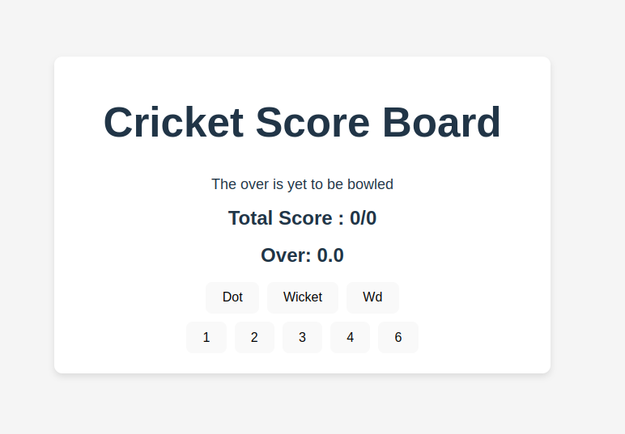
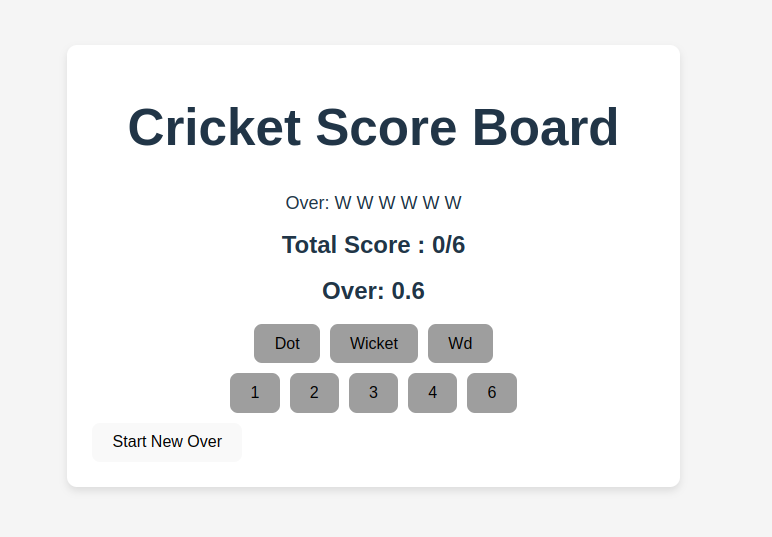
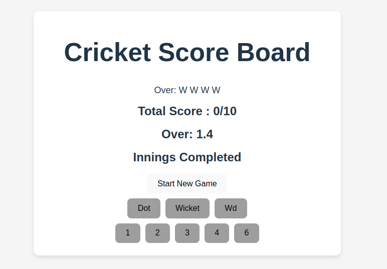

# Cricket Score Board ##[React + Vite]

This template provides a minimal setup to get React working in Vite with HMR and some ESLint rules.
Currently, two official plugins are available:

## Features

- **React with Vite**: Fast and minimal setup using Vite for a smooth development experience.
- **Hot Module Replacement (HMR)**: Instant updates in the browser without losing state.
- **ESLint**: Integrated ESLint rules to maintain code quality.
- **Cricket Score Tracker**: An application to track cricket scores, overs, and wickets.

## Plugins

This project uses two official plugins:

- [@vitejs/plugin-react](https://github.com/vitejs/vite-plugin-react/blob/main/packages/plugin-react/README.md): Uses [Babel](https://babeljs.io/) for Fast Refresh.
- [@vitejs/plugin-react-swc](https://github.com/vitejs/vite-plugin-react-swc): Uses [SWC](https://swc.rs/) for Fast Refresh.

## Screenshots

### Home Screen


### Start New Over


### Start New Game


## Getting Started

1. **Clone the repository**:
   ```bash
   git clone https://github.com/Tanmay-say/Cricket_Score_Reactpro.git
   cd Cricket_Score_Reactpro 
   ```

2. **Install dependencies**:
   ```bash
   npm install
   ```

3. **Run the development server**:
   ```bash
   npm run dev
   ```
## Usage

The application allows you to:

- **Track Runs**: Add runs by clicking the respective buttons (1, 2, 3, 4, 6).
- **Track Wickets**: Record a wicket by clicking the "Wicket" button.
- **Record Dot Balls**: Add a dot ball by clicking the "Dot" button.
- **Handle Wide Balls**: Record a wide ball by clicking the "Wd" button.
- **Start New Over**: Begin a new over once the current one is completed.
- **Start New Game**: Reset the entire game to start fresh.

Enjoy building with React and Vite! For any issues or questions, feel free to open an issue on GitHub.